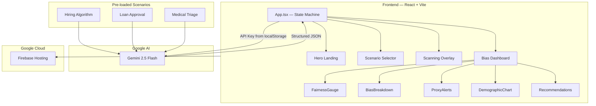

<div align="center">

  <h1>🔍 BiasLens</h1>
  <p><strong>AI that Audits AI</strong></p>
  <p>
    <em>Expose hidden discrimination in automated decision systems — before they harm real people.</em>
  </p>

  <br />

  
  
  
  
  
  
  

  <br /><br />

  
  
  
  
  

  <br /><br />

  <a href="#-key-features">Features</a> •
  <a href="#-quick-start">Quick Start</a> •
  <a href="#%EF%B8%8F-architecture">Architecture</a> •
  <a href="#-tech-stack">Tech Stack</a> •
  <a href="#-team">Team</a>

</div>

<br />

## 🎯 The Problem

> *"An AI denied your daughter a scholarship because of her zip code. She never knew why."*

Computer programs now make **life-changing decisions** about who gets a job, a bank loan, or medical care. But when these systems learn from flawed historical data, they **repeat and amplify** the exact same discriminatory patterns — silently, at scale, with no accountability.

**The cost of unchecked AI bias:**
- 🏢 **Hiring:** Women rejected 2.3x more than men by resume screening algorithms
- 🏦 **Lending:** Approval rates differ by 29% across racial demographics for identical financial profiles
- 🏥 **Healthcare:** Black patients assigned lower urgency scores than white patients with identical symptoms

---

## 💡 The Solution

**BiasLens** is an AI-powered fairness auditor that uses **Google Gemini 2.5 Flash** to perform deep bias analysis on automated decision systems. Instead of showing raw statistics, BiasLens tells the **story behind the numbers** — revealing hidden proxy variables, quantifying demographic impact, and providing actionable fix recommendations.

### How it works:
1. **Select** a scenario (Hiring Algorithm, Loan Approval, or Medical Triage)
2. **Gemini AI** performs comprehensive bias audit with structured JSON output
3. **Visual dashboard** renders animated results: fairness gauge, radar charts, proxy alerts, and recommendations

---

## ✨ Key Features

- 🔴 **Hidden Proxy Detection** — Discovers variables that *appear* neutral (zip code, university) but secretly correlate with protected attributes (race, gender, age). *This is our killer feature.*
- 📊 **Animated Fairness Gauge** — SVG circular gauge with cubic-eased animation scoring overall fairness 0-100
- 🕸️ **Fairness Metrics Radar** — Four-axis radar chart: Statistical Parity, Equal Opportunity, Predictive Parity, Individual Fairness
- 📈 **Demographic Impact Chart** — Color-coded bar chart showing approval rate disparities across groups with average reference line
- 🎯 **Severity Classification** — CRITICAL / HIGH / MODERATE / LOW with glowing neon badges
- ✅ **Smart Recommendations** — Priority-ranked actionable fixes with effort estimates (LOW/MEDIUM/HIGH)
- ⚡ **Cinematic Scanning Animation** — Pulsing orb + scan line + cycling status messages that mask API latency with drama
- 🌑 **Premium Dark UI** — Glassmorphism cards, ambient glow orbs, custom scrollbar, neon accents (Cyan for neutral, Red for bias)
- 🤖 **Powered by Gemini 2.5 Flash** — Structured JSON output via `responseMimeType: 'application/json'` for reliable parsing

---

## 🛠️ Tech Stack

<div align="center">

| Layer | Technology | Purpose |
|:-----:|:----------:|:--------|
| **Frontend** | React 19 + TypeScript | Component architecture with strict typing |
| **Build** | Vite 8 | Sub-second HMR, optimized production builds |
| **Styling** | Tailwind CSS v3 | Utility-first responsive design system |
| **AI Engine** | Google Gemini 2.5 Flash | Structured bias analysis with JSON output |
| **SDK** | @google/genai | Latest Google GenAI SDK |
| **Charts** | Recharts | Radar charts, bar charts, demographic visualizations |
| **Animations** | Framer Motion | Spring physics, staggered reveals, scanning overlay |
| **Icons** | Lucide React | Consistent iconography |
| **Deployment** | Firebase Hosting | Google Cloud native deployment |

</div>

---

## 🏗️ Architecture



---

## 🚀 Quick Start

### Prerequisites

- **Node.js** ≥ 18.0
- **npm** ≥ 9.0
- **Google Gemini API Key** — [Get one free](https://aistudio.google.com/apikey)

### Installation

```bash
# Clone the repository
git clone https://github.com/Shreekumar-Shah-AICTE/BiasLens.git
cd BiasLens

# Install dependencies
npm install

# Start the development server
npm run dev
```

> 🌐 Open [http://localhost:5173](http://localhost:5173) in your browser

### Usage

1. Click **"Begin Bias Audit"**
2. Enter your **Gemini API key** when prompted (stored in localStorage, never sent to any server except Google)
3. Select a scenario: **Hiring Algorithm**, **Loan Approval**, or **Medical Triage**
4. Watch the cinematic scanning animation
5. Explore the interactive bias audit dashboard

---

## 📁 Project Structure

```
BiasLens/
├── public/                          # Static assets
├── src/
│   ├── components/
│   │   ├── FairnessGauge.tsx        # Animated SVG circular gauge
│   │   ├── BiasBreakdown.tsx        # Radar chart + severity bars
│   │   ├── ProxyAlerts.tsx          # Hidden proxy detection cards
│   │   ├── DemographicChart.tsx     # Approval rate bar chart
│   │   ├── Recommendations.tsx      # Priority-ranked fix cards
│   │   └── ScanningOverlay.tsx      # Cinematic scanning animation
│   ├── lib/
│   │   ├── gemini.ts                # Gemini API integration + system prompt
│   │   └── scenarios.ts             # 3 pre-loaded bias scenarios
│   ├── types/
│   │   └── index.ts                 # TypeScript interfaces for bias analysis
│   ├── App.tsx                      # Main app — 4-state machine
│   ├── index.css                    # Premium dark theme + glassmorphism
│   └── main.tsx                     # React entry point
├── index.html                       # SEO-optimized entry
├── tailwind.config.js               # Custom color system + animations
├── vite.config.ts                   # Vite configuration
├── tsconfig.json                    # TypeScript config
└── package.json                     # Dependencies
```

---

## 🌍 UN SDG Alignment

<div align="center">

### SDG 10: Reduced Inequalities

*"Reduce inequality within and among countries"*

</div>

BiasLens directly addresses **Target 10.3**: *"Ensure equal opportunity and reduce inequalities of outcome, including by eliminating discriminatory laws, policies and practices."*

Automated decision systems are the new discriminatory policies — invisible, scalable, and unchecked. BiasLens provides organizations with the tools to **audit, understand, and fix** algorithmic discrimination before it impacts real people.

**Impact potential:**
- Every company using AI for hiring, lending, or healthcare decisions needs bias auditing
- Regulatory frameworks (EU AI Act, US Algorithmic Accountability Act) are mandating fairness audits
- BiasLens democratizes access to bias detection — no data science degree required

---

## 💪 What Sets Us Apart

| Feature | Typical Bias Tool | BiasLens |
|---------|:-----------------:|:--------:|
| Analysis Method | Manual statistics | AI-powered deep analysis |
| Proxy Detection | ❌ Not available | ✅ Hidden variable correlation |
| Output Format | Raw CSV tables | Animated visual dashboard |
| Explainability | Technical jargon | Plain language explanations |
| Recommendations | Generic advice | Priority-ranked, effort-estimated fixes |
| User Experience | Developer-only CLI | Anyone can use it |
| Setup Time | Hours of config | 30 seconds |

---

## 🔮 Future Roadmap

- 📤 **Custom Dataset Upload** — Analyze your own CSV/JSON data for bias (Q3 2026)
- 📄 **PDF Audit Reports** — Downloadable compliance-grade fairness reports (Q4 2026)
- 🔄 **CI/CD Bias Monitoring** — Auto-audit models on every deployment (2027)
- 🌐 **Multi-language Support** — Audit reports in 10+ languages
- 🏢 **Enterprise API** — RESTful API for integrating bias checks into ML pipelines

---

## 👥 Team

<div align="center">

|  |
|:---:|
| **Shreekumar Shah** |
| [@Shreekumar-Shah-AICTE](https://github.com/Shreekumar-Shah-AICTE) |
| Full Stack Developer & AI Engineer |
| BCA, Kaushalya — The Skill University, Gujarat, India |
| Team O(1) |

</div>

---

## 📄 License

This project is licensed under the MIT License — see the [LICENSE](LICENSE) file for details.

---

<div align="center">

  <br />

  **Built with ❤️ for Google Solution Challenge 2026**

  *Ensuring every AI decision is fair.*

  <br />

  
  
  

</div>
